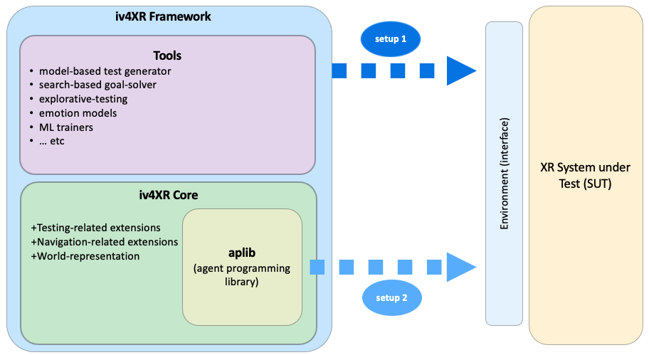

# iv4xr-core <a name="top"></a>

* [The build instructions are below](README.md#buildinstr)
* [APIs Javadoc documentation](http://www.staff.science.uu.nl/~prase101/research/projects/iv4xr/aplib/apidocs/)
* [Agent programming manuals and tutorials](./docs/agentprogramming.md)
* [Agent-based testing manuals and tutorials](./docs/agentbasedtesting.md)
* [Code snippets](README.md#snippets)
* [Papers](README.md#papers)
* **Video:** [10m demo of iv4xr](https://youtu.be/Hc8NP4NuHAk).

Despite the packaging name 'aplib' this project should be called *iv4XR-core*, of which aplib is part of.

**Iv4xr-core** (which we will also refer to as the 'Core') forms the core of a bigger framework with the same name: **iv4xr Framework**, and hence the name 'core'. Outside the Framework, both the Core and its aplib part can also be used independently.

Iv4xr Framework aims to provide tools for agent-based automated testing for testing highly interactive systems. The Core provides the underlying agent-based programming and agent-based testing infrastructure.
Our own use case is to use the framework for testing Extended Reality (XR) systems. Within this use case, the Framework has been piloted for testing 3D games. The framework itself is generic: it can be used to target *any system* (even systems that are not interactive, such as a collection of APIs) as long as the agents can interface with the system. To do this, an interface needs to be provided, which boils down to implementing a certain interface-like class.


The position of the iv4xr-core in the **Framework** is shown in the picture below:

   

The **Core** provides the agent-based testing infrastructure. The pure agent-programming part is provided by a package (in the Core) called **aplib** (shorthand of Agent Programming Library) within the Core. This library is actually general purpose, and can be used to program agents for purposes other than testing.
On top of aplib, the Core adds testing-related functionalities and few other extra functionalities like a common world representation.
Using iv4xr-core can be seen as a special case of using aplib, where you get some testing-specific extra capabilities, such as expressing test oracles.

In the picture above, *setup-2* is a setup where we only use the Core to target a System Under Test (SUT). This is possible, and we will have access to aplib's agent programming to program the test automation.
When the entire Framework is ready, *setup-1* uses the entire Framework. The 'Framework' adds other testing-related tools, such as a model-based testing library, explorative testing using Testar, etc, which are then also at your disposal.

The entire iv4xr-core is a Java library. The simplest setup to use iv4xr is:

  1. Create a Java method m() where you create one agent a.
  1. An agent is typically used to control some environment (e.g. a game). Attach an interface that would connect the agent a to the environment.
  1. formulate a goal for the agent a (e.g. to win the game), and program a tactic to accomplish/solve the goal.
  1. run the method m().

When the agent is used for testing, then we need an agent that is also a test agent; this would have some extra functionalities such as collecting test verdicts. For concrete examples see the tutorials povided [here (general about agent)](./docs/agentprogramming.md) and [here (for test-agent)](./docs/agentbasedtesting.md).

**Features:**

* **Fluent interface** style of APIs.
* BDI-inspired agents: they have their own states (their belief) and goals. The latter allows them to be programmed in a goal-oriented way.
* Combinators for **high level goal and tactical programming**.
* **Multi agent**: programming multiple agents controlling the a shared environment and communicating through channels.
* **Prolog binding**: allowing agents to do prolog-based reasoning to help them solving goals.
* **Bounded LTL**: for expressing temporal properties that can be checked during testing.
* **A model checker**: also to help solving goals, when models of the problem is known.
* Data collection: agents can collect traces for post-mortem data analyses.

Planned features:

* Reinforcement learning
* Search algorithms for solving goals

**Papers** <a name="papers"></a>

  * Concepts behind agent-based automated testing:
  [_Tactical Agents for Testing Computer Games_](https://emas2020.in.tu-clausthal.de/files/emas/papers-h/EMAS2020_paper_6.pdf)
I. S. W. B. Prasetya, Mehdi Dastani, Rui Prada, Tanja E. J. Vos, Frank Dignum, Fitsum Kifetew,
in Engineering Multi-Agent Systems workshop (EMAS), 2020.

  * The agents' execution loop is explained  in this draft: [I.S.W.B. Prasetya, _Aplib: Tactical Programming of Intelligent Agents_, draft. 2019.](https://arxiv.org/pdf/1911.04710)

  * Extended abstract: [_Aplib: An Agent Programming Library for Testing Games_](http://ifaamas.org/Proceedings/aamas2020/pdfs/p1972.pdf), I. S. W. B. Prasetya,  Mehdi Dastani, in the International Conference on Autonomous Agents and Multiagent Systems (AAMAS), 2020.

**Manuals, Reference, and Tutorials**: see [above](README.md#top).

#### Some code snippets: <a name="snippets"></a>

* Specifying a goal. The goal below is solved when offered a value x == 10.

```java
goal("Magic number is guessed!").toSolve((Integer x) -> x == 10)
```

* Specifying a tactic. A tactic specifies a program/heuristic for solving a goal. It could look like this:

```java
FIRSTof(guessLowerbound.on_((Belief belief) -> ! belief.feelingVeryLucky() ,
        ANYof(speculate1,
              speculate2,
              ...)
```        

* Creating and configuring an agent in the _fluent interface_ style:

```java
new AutonomousBasicAgent()
    . attachState(new StateWithMessanger() .setEnvironment(new ConsoleEnvironment()))
    . setGoal(topgoal)
    . setSamplingInterval(1000)
```

* Launching an autonomous agent on a new thread:

```java
new Thread(() -> agent.loop()) . start()
```

## Building with Maven  <a name="buildinstr"></a>

You need Java-11 or higher.

You can run `mvn` (Maven) at the project root to do the things listed below. Maven will put artifacts it produces under the directory `./target` in the project root.

* To compile the project: `mvn compile`
* To run the project unit tests: `mvn test`
* To produce a jar of the project: `mvn package`. This will invoke `compile` and `test`, and then produce a jar containing the whole project. This is the jar you want to use if you want to include in your own project if you want to use `aplib`.
* To generate the javadoc APIs documentation: `mvn javadoc:javadoc`. The resulting documentations can be found in `./target/site/apicdocs`.
* To clean `./target`: `mvn clean`

#### Projects dir. structure

* `./src/main/java` : the root of `aplib` Java source code.
* `./src/test/java` : the root of Java source code of `aplib` unit tests.
* `./docs/manual` : contain some tutorials and documentations.
* `./libs` : external jars provided for convenience. You should not need these jars if you build using Maven. They are needed if you want to work on aplib itself and want to just link the jars immediately.

## License

Copyright (c) 2019, Utrecht University.

`Aplib` is an open source software. It can be used and distributed under the
[LGPL version 3 license](./lgpl-3.0.md).

#### Credits

Contributors:
* Wishnu Prasetya, Naraenda Prasetya, Saba Ansari, Samira Shirzadeh, Fitsum Kifetew.
