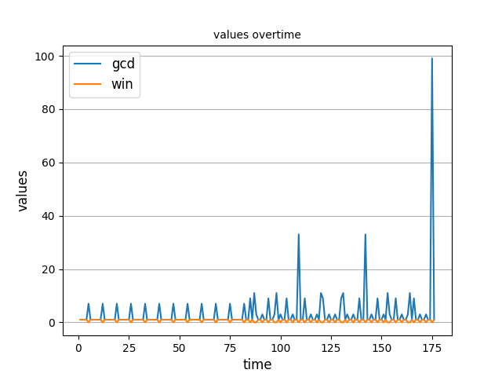

# Data Collection
Author: Wishnu Prasetya

**Prerequisite:** you have read at least the following tutorials:

* [`iv4xr` Tutorial 1](./testagent_tutorial_1.md), explaining the basic of how to use an `iv4xr` agent for testing.
* [`iv4xr` Tutorial 2](./testagent_tutorial_2.md), explaining an architecture where we pretend that the program to test is an external program. We will use this architecture in this tutorial.

Consider again the setup as in [`iv4xr` Tutorial 2](./testagent_tutorial_2.md) where we want to test a simple game called GCD game. Let us create an agent called "agentSmith", with some-role-name (which does not matter for this tutorial):

```java
var agent = new TestAgent("agentSmith","some role") ;
		agent . attachState(new MyState())
		      . attachEnvironment(new GCDEnv())
		      . setTestDataCollector(new TestDataCollector())
		      . setGoal(topgoal);
```

Well, before we get to that let's first create a test agent, and a goal for it. The goal does not matter for this tutorial; just something so that the agent has something to do:


```java
var agent = new TestAgent("agentSmith","some role") ;
```

Let's also define a goal. It does not matter what; for this example we just need the agent to do something. In this case the goal is to get the agent to the grid location (100,99) in the GCD-game:

```java
var topgoal = goal("tg")
			  .toSolve((MyState S) -> S.x == 100 && S.y == 99)
			  .withTactic(...)
			  .lift();
```

Let's attach a state and a proper environment (in this case: an instance of GCDEnv) to the agent, and we assign the above goal to the agent too:

```java
agent . attachState(new MyState())
	  . attachEnvironment(new GCDEnv())
	  . setTestDataCollector(new TestDataCollector())
      . setGoal(topgoal);
```

### Data-collector

To collect trace we will need to attach a data-collector to the agent. This is already done above through the method `setTestDataCollector()`.

### Instrumenter

We also need to attach an 'instrumenter', which is a point that extract values from a state (you decide which values/parts of the state to extract), and bundle them in a 'data-point'. Technically, this data point is a set of name-value pairs (more precisely, an instance of `Pair<String,Number>[]`). Suppose we already have a method that acts as such an instrumenter:

```java
Pair<String,Number>[] instrumenter(MyState st) { ... }
```

This is how to attach it to the agent:

```java
agent.withScalarInstrumenter(state -> instrumenter((MyState) state))
```

The following instrumented is used:

```java
Pair<String,Number>[] instrumenter(MyState st) {
	Pair<String,Number>[] out = new Pair[5] ;
	out[0] = new Pair<String,Number>("posx",st.x) ;
	out[1] = new Pair<String,Number>("posz",st.y) ;
	out[2] = new Pair<String,Number>("time",st.time) ;
	out[3] = new Pair<String,Number>("gcd",st.gcd) ;
	out[4] = new Pair<String,Number>("win",st.win ? 1 : 0) ;
	return out ;
}
```

### Running the agent and collecting the trace

The following will run the agent:

```java
while (!topgoal.getStatus().success()) agent.update() ;
```

After that, `agent.getTestDataCollector().getTestAgentScalarsTrace(agent.getId())` will give us the trace that was collected when the agent was ran above. However, let us clean this trace a bit so that we get a list/sequence of values:

```java
List<Map<String,Number>> trace = agent
				. getTestDataCollector()
				. getTestAgentScalarsTrace(agent.getId())
		        . stream()
		        . map(event -> event.values) . collect(Collectors.toList());
```

### Printing and saving a trace

You can print this trace if you want. Just do:

   `System.out.println(trace) ;`

To save the trace in a csv-file do:

   ```java
   agent.getTestDataCollector()
        .saveTestAgentScalarsTraceAsCSV(agent.getId(),"trace11.csv");
```

The resulting file looks like this:

```
gcd,posx,posz,time,win
1,7,17,1,1
1,7,18,2,1
1,7,19,3,1
1,7,20,4,1
...
```

### Data analysis and visualisation

Collected traces are csv-files containing numeric values, so they can be subjected data analyses and visualisation with external tools. The project itself contains a Python-script to produce time-graphs and heatmaps from trace files. The script can be found in `./scripts`. Running it with the `--help` option will show available options. An example of produced timegraph is shown below:

 
