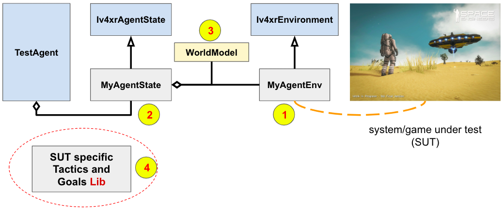

# Testing a Computer Game with iv4xr

[Tutorial-1](./testagent_tutorial_1.md)  and [tutorial-2](./testagent_tutorial_2.md) introduced the general idea of using an iv4xr to test a computer game along with some of the basic concepts of iv4xr testing, such as _goal_ and _tactic_. We also pointed out that the agent will need an interface (called 'environment') to the game and its own 'agent state'.

The game used in those tutorials was rather artificial. To handle an actual game it is recommended to use a more extended architecture, shown in the UML diagram below:

<a name="archtop"></a>


In this architecture the [test agent](../../src/main/java/eu/iv4xr/framework/mainConcepts/TestAgent.java) will need several components; see below. Some of these components are game-specific, so we can't provide general components that would work for all games.
An example will be given later.

1. An implementation of [`Iv4xrEnvironment`](../../src/main/java/eu/iv4xr/framework/mainConcepts/Iv4xrEnvironment.java). This implementation is responsible for handling the interaction with the system under test (SUT), such as sending a command to the SUT and to obtain observation of the SUT state.

1. A direct instance or an implementation of [`Iv4xrAgentState`](../../src/main/java/eu/iv4xr/framework/mainConcepts/Iv4xrAgentState.java) to hold the agent's state. Among other things, this state will hold a `WorldModel` (a feature inherited from `Iv4xrAgentState`) which is a generic representation of the SUT's gamestate. If you need other information to be kept track, this can be accommodated in your own subclass of `Iv4xrAgentState`; else, you can directly use `Iv4xrAgentState`.

1. Above we mentioned that the SUT's gamestate will be represented generically as an instance of [`WorldModel`](../../src/main/java/eu/iv4xr/framework/mainConcepts/WorldModel.java), where actual gameobjects are represented by instances of [`WorldEntity`](../../src/main/java/eu/iv4xr/framework/mainConcepts/WorldEntity.java). This does mean that observations that come from MyAgentEnv are expected to be instances of this `WorldModel`. So, as part of your implementation of MyAgentEnv you also need to translate the state of your gameobjects to instances of `WorldEntity`, and your overall gamestate to an instance of `WorldModel`.

1. To do something smart, such as automatically navigating to a destination, your agent will need a bunch of tactics and goals. These are game-specific, so you will also need to construct a library of these.

### Implementing `Iv4xrEnvironment`

To implenent the class [`Iv4xrEnvironment`](../../src/main/java/eu/iv4xr/framework/mainConcepts/Iv4xrEnvironment.java) (with your own MyAgentEnv subclass) you essentially need to implement the following methods

1. `observe(agentId)` : this returns an observation on the SUT's state. This observation is expected to be an instance of the a `WorldModel`.

1. Implement other primitive interactions with the SUT, e.g. a command to move the player-character a small distance to a certain direction and a command to make the player-character interacts with a gameobject next to it. You can optionally make use of the method `sendCommand()` that is provided by the superclass [`Environment`](../../src/main/java/nl/uu/cs/aplib./mainConcepts/Environment.java) to send commands to the SUT. In turn, `sendCommand()` invokes `sendCommand_()` whose implementation you need to provide (via overriding).

1. Optionally implement the method `worldNavigableMesh()`. This method is expected to construct a surface-mesh of the navigable parts/surfaces of your gameworld. The class [`Iv4xrAgentState`](../../src/main/java/eu/iv4xr/framework/mainConcepts/Iv4xrAgentState.java) has some utilities to conver such a mesh to a navigation graph. Ultimately, what is needed is a navigation graph (at least, if you want the agent to be able to automatically navigate to places). So, if you can't provide a mesh, there are other means to construct a navigation graph. Check the classes in the package `eu.iv4xr.framework.extensions.pathfinding`.

### WorldModel (WOM)

Above we said that the method `observe()` from MyAgentEnv returns the observation as an instance of `WorldModel` (also called 'WOM'). The structure of this WOM is shown below:


A WOM is an observation from the perspective of a certain agent, so it also hold information about this agent, such as its id and position in the gameworld. A WOM will also hold zero or more `WorldEntity`, each represent a certain game object in the SUT.

Among other things, a WorldEntity holds information about the id of this entity, its position in the gameworld, and a list name-value properties (e.g. if the entity is a door, it might hold a property named 'isOpen' to indicate whether this door is open/closed).

Both WorldModel and WorldEntity have timestamps to indicate how recent the observation is.


### The structure of `Iv4xrAgentState`

As said before, your test agent needs a state. Such a state is an instance of [`SimpleState`](../../src/main/java/nl/uu/cs/aplib./mainConcepts/SimpleState.java) but it is recommended to use the class [`Iv4xrAgentState`](../../src/main/java/eu/iv4xr/framework/mainConcepts/Iv4xrAgentState.java), for example because this class already integrate `WorldModel` and has some utility to support pathfinding. Either you use this class directly, or make your own subclass.

The structure of `Iv4xrAgentState` is shown below.


An instance Iv4xrAgentState of holds:

* A WorldModel, representing the lastly observed state of the SUT. This is accessible through the getter `wom()`. Initially this WOM will be null. The first call to `updateState()` will initialize it.

* An instance of [`Navigatable`](../../src/main/java/eu/iv4xr/framework/extensions/pathfinding/Navigatable.java) representing a navigation graph. This is accessible through the field/getter `worldNavigation`. Given such a graph, a pathfinding algorithm can calculate a path to go from one location to another. A test agent can use this to auto-navigate from its current location to some destination. The package `eu.iv4xr.framework.extensions.pathfinding` contains a number of implementations of navigation graph and pathfinding that you can use. The class `Iv4xrAgentState` itself does not construct a navigation graph; you have to provide one for it. Such a graph can be obtained from e.g. a surface/navigation-mesh (see e.g. the method `loadSimpleNavGraph()`). Or we can use a grid/tiled navigation graph, which does not require any mesh to construct. See e.g. the class [Sparse2DTiledSurface_NavGraph](../../src/main/java/eu/iv4xr/framework/extensions/pathfinding/Sparse2DTiledSurface_NavGraph.java).

* An instance of `Iv4xrEnvironment`, through which the agent can control and observe the SUT. This environment is accessible through the getter `env()`.

If all these are sufficient for you then you can just directly use `Iv4xrAgentState` (you don't need to subclass it to extend its state structure).

All agent-state has the method `updateState()`, which the agent will call from time to time to refresh this state. This is an important method.
When this method is called, it will automatically request a fresh observation from MyAgentEnv that linked to it. The fresh WorldModel returned by this observation will then be _merged_ with the current WorldModel held by the agent-state (or taken over, if the agent-state still has no WorldModel). _Merging_ means that the state of the WorldEntities will be updated with the new observation. If the new observation contains entities not seen before, this will be added to the agent-state's WorldModel. If the state of a WorldEntity is updated, the merging also keeps the old state, and link this to the new state. The old state can be obtained through the method `getPreviousState()`. Only one previous state will be kept :)

# Example: the game MiniDungeon

We have included a simple game called MiniDungeon, to provide you with a bigger testing example than the smallish [GCGGame](./testagent_tutorial_1.md) example.

If you are impatient, a simple example of agent-test is in [`SimpleTestMiniDungeonWithAgent`](../../src/test/java/eu/iv4xr/framework/exampleTestAgentUsage/miniDungeon/SimpleTestMiniDungeonWithAgent.java). You can peek in it and run it (with JUnit) :) Turn on the flag `withGraphics` so you can visually see the game.


#### The MiniDungeon game

You can try the game by running
the main-method of the class [`DungeonApp`](../../src/main/java/nl/uu/cs/aplib/exampleUsages/miniDungeon/DungeonApp.java). You can change game configuration there e.g. to have more (or less) monsters, to have a bigger level, etc:

```Java
main(String[] args) throws Exception {		
		MiniDungeonConfig config = new MiniDungeonConfig() ;
		config.numberOfMonsters = 20 ;
		config.numberOfHealPots = 8 ;		
		config.viewDistance = 5 ;
    ...
		var app = new DungeonApp(config) ;
		deploy(app);
	}
```


The game is played by either one or two players (Frodo and Smaegol), played on a single computer (e.g. they can use two keyboards connected to a single laptop). They players can either work together, or against each other.

**Game play.** A player can go from one level to the next one, until the final level. Access to the next level is guarded by a _shrine_, which can teleport the player to the next level. However, the shrine must be _cleansed_ first before it can be used as a teleporter. To cleanse it, the player needs to use a _scroll_ (gray icon in the game). There are usually several scrolls dropped in a level, but only one of them (a holy scroll) can do the cleansing. The player does not know which scroll is holy until it tries to use it on a shrine. There are also monsters in the levels that can hurt the player, but also potions that can heal the player or enhance its combat.

**Visual visibility.** By default the player/s have limited visibility, e.g. they can only see tiles in the radius k around their characters (in the above screenshot the visibility distance has been set to very large, just to show you the entire level in that example). To maintain realism, our implementation of the method `observe()` respects this visibility constraint. That is, it will only include observation on gameobjects within the visibility range of the agents.

**Control:**

* Player-1 (Frodo): move up/left/down/right with wasd keys. Key e uses a healing potion, key r uses a rage potion.
* Player-2 (Smeagol): move up/left/down/right with ijkl keys. Key e uses o healing potion, key p uses a rage potion.
* Moving onto an object interacts with it. If it is a scroll or potion, the player will pick it and put it inside its bag.
* q to quit, r to restart the game.

**Players:**

* Frodo's bag can hold two items, but Frodo has less health point (HP).
* Smeagol's bag can only hold one item. Smeagol has more HP and higher attack rating.

#### Testing Example

A simple example of a test using an agent is shown in [`SimpleTestMiniDungeonWithAgent`](../../src/test/java/eu/iv4xr/framework/exampleTestAgentUsage/miniDungeon/SimpleTestMiniDungeonWithAgent.java). It has one test, namely `test1()`. Run it with JUnit. Turn on the flag `withGraphics` so you can visually see the game.

The test sequence is formulated by this goal structure:

```Java
var G = SEQ(
   goalLib.smartEntityInCloseRange(agent,"S0_1"),
   goalLib.entityInteracted("S0_1"),
   goalLib.smartEntityInCloseRange(agent,"SM0"),
   goalLib.entityInteracted("SM0"),
   SUCCESS()) ;
```

This instructs the agent to find and pick up an item; more precisely: a scroll, identified by id `S0_1`. Then the agent is instructed to go the shrine of level-0, identified by `SM0`, and interacts with it. This has the effect of using the scroll `S0_1` on the shrine. The goal `SUCCESS()` is added to insert an extra observation step. The goal structure itself does not include any oracle checking, but at the end of the test we check the agent state: we expect the last observation on the shrine to state that it is now cleansed (due to using S0_1 on it):

```Java
WorldEntity shrine = state.worldmodel.elements.get("SM0") ;
assertTrue((Boolean) shrine.properties.get("cleansed")) ;
```

Note the goal `smartEntityInCloseRange(id)` introduces automation. It will automatically guide the agent to a position next to the gameobject/entity identified by id. This will require pathfinding that we discussed before. The goal also includes some 'AI':

* If the target entity has not been seen before (so, the agent also does not know its location), the goal will first direct the agent to explore the gameworld until the entity is seen.
* It handles combat, if the agent gets attacked by monsters (attacking back, using potions etc).
* It pickups a potion that happens to be close to its path, and if it has a place left in its bag.


### Building the needed iv4xr-infrastructure of MiniDungeon


This follows [the architecture](#archtop) mentioned at the beginning of this document. It specifies the components need to be built to facilitate iv4xr testing on the SUT. This will take some effort, but this is a one-off investment, afterwhich we can keep using the infrastructure to do iv4xr automated testing on the SUT.

1. We need to build an basic interface to the game, and it has to implement the  class  [`Iv4xrEnvironment`](../../src/main/java/eu/iv4xr/framework/mainConcepts/Iv4xrEnvironment.java). For the MiniDungeon game this is implemented in the class [`MyAgentEnv`](../../src/main/java/nl/uu/cs/aplib/exampleUsages/miniDungeon/testAgent/MyAgentEnv.java). Importantly the class implements:

  * The method `observe()`. The returned observation is an instance of [`WorldModel`](../../src/main/java/eu/iv4xr/framework/mainConcepts/WorldModel.java). The class `MyAgentEnv` implements the conversion of MiniDungeon's gamestate to `WorldModel`.
  * The method `action(cmd)` to command a player-character to do an action such as move (a single tile) or using a potion.

1. Define a class that will become your agent-state. We can either directly uses the class [ Iv4xrAgentState](../../src/main/java/eu/iv4xr/framework/mainConcepts/Iv4xrAgentState.java) or write our own subclass of it. For MiniDungeon a subclass called [MyAgentState](../../src/main/java/nl/uu/cs/aplib/exampleUsages/miniDungeon/testAgent/MyAgentState.java) is defined:

   * It adds some useful getters, such as to get the set of monsters that are adjacent to the agent.
   * It adds a field `multiLayerNav` representing a multi-layered navigation graph. We need multi-layer for MiniDungeon as the game may created (depending on your configuration) multiple levels, and players can go back and forth between levels. The class that provide this navigation graph is called [`LayeredAreasNavigation`](../../src/main/java/eu/iv4xr/framework/extensions/pathfinding/LayeredAreasNavigation.java). It provides, among other things, a pathfinding method.
1. The classes [`TacticLib`](../../src/main/java/nl/uu/cs/aplib/exampleUsages/miniDungeon/testAgent/TacticLib.java) and [`GoalLib`](../../src/main/java/nl/uu/cs/aplib/exampleUsages/miniDungeon/testAgent/GoalLib.java) provides a library of game-specific tactics and goals. Essentially, this is the library that provides automation, e.g. the goal `smartEntityInCloseRange(id)` mentioned before.

  High level test-steps (e.g. navigating to an entity, interacting with an entity) can be implemented by a goal provided by `GoalLib`. A high level test sequence would then be implemented as a goal structure e.g. in the form `SEQ(goal1,goal2,...)`.

  Each goal will need a tactic to solve/achieve it. Basic tactics are provided in `TacticLib`. These are essentially compositions of primitive actions provided by MyAgentEnv, though the compositions can be quite complex, e.g. the tactic `navigateToTac(id)` involves calculating a path, using a pathfinder, to the entity id, and then following this path.

### Automated navigation

An example of a tactic that can guide the testagent to a target entity is shown below. The code is simplified to show its logic. For actual implementation see the class `TacticLib` of MiniDungeon.

```Java
Tactic navigateToTac(String targetId) {
   Action a = action("move-to").do2((MyAgentState S) ->  (Tile nextTile) -> {
      WorldModel newwom = moveTo(S,nextTile) ;
      return newwom ;
   })
   .on((MyAgentState S) -> {
      var target = S.worldmodel.elements.get(targetId) ;
      var path = findPath(S.worldmodel().position,target.position) ;
      if (path == null) return null ;
      else return path.get(1) ; })
    ;
    return a.lift() ;
}
```  

In the guard of the tactic (`on(...)` part), the tactic calculates a path to the destination entity. Then, the next tile in this path is passed to the action part, which is then translated to `moveTo()` action to move the agent to that next tile[^1].

[^1]: This implementation is less efficient because it keeps calculating the path at every update cycle. A more efficient implementation can store the pathn to avoid re-calculation.

If we just execute this tactic in e.g. a loop of updates (where each time we invoke `agent.update()`), the tactic will indeed bring the agent to the destination, but then it will keep on looping as a tactic in itself has no concept of termination. For this we use goals. E.g. we can define the corresponding goal as:

```Java
Goal entityInCloseRange(String targetId) {
   Goal g = goal("Entity " + targetId + " is touched.")
        .toSolve(WorldModel observation) -> {
            var target = observation.elements.get(targetId) ;
            return adjacent(observation.position,target.position) ;
        }
        .withTactic(navigateToTac(targetId)) ;
   return g ;
}
```

The goal is solved when the agent is adjacent to the destination entity. To solve it we use the previously defined `navigateToTac` tactic.

The actual implementation of this tactic and goal for MiniDunegon is a bit more complicated, e.g. to take its multi-level into account. The classes `GoalLib` and `TacticLib` also contains a bunch of other, more intelligent, tactics and goals.
